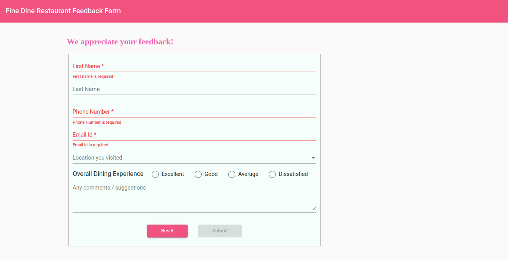

## Practice: Develop a Restaurant Feedback Form for Fine Dine Restaurant

### Context

Fine Dine Restaurant is a popular restaurant with branches located in various parts of the United States. Its website provides various details about the location of its branches, process of making reservations and the various items offered by the restaurant. ​

The restaurant's management wants to collect customer feedback to improve the customer experience. ​

A restaurant feedback form is a tool that customers are asked to fill up to provide feedback about their dining experience. This form will ask for basic details such as customer name, its contact details, location they visited, etc. besides asking for the overall rating for the dining experience. The form will also seek suggestions for improvement.​

You, as a web developer have been assigned the task to design and create the feedback form for the Fine Dine restaurant.

### Problem Statement
Design and create a template-driven feedback form for the Angular application that is given in the boilerplate.​

Expected output for the Angular application should resemble the following images.





### Task Details

To develop the solution for the Fine Dine restaurant application, following tasks need to be completed: 

- Task 1: Create Data Model
- Task 2: ​Include Required Modules
- Task 3: ​Create the Feedback Component​
- Task 4: Define the Form Layout Inside Template​
- Task 5: Add validation attributes to form controls​
- Task 6: Handle Form Validation 
- Task 7: Display notification message upon successful form submission​

#### Task 1: Create Data Model​

- Create data model `Feedback` that reflect the form data model.​
- Create type `Feedback` in the `feedback.ts` file in the `models` folder with the following type properties:​
    - id (number)​
    - firstName (string)​
    - lastName (string)​
    - email (string)​
    - phone (number)​
    - location (string)​
    - rating (number)​
    - comments (string)​

**Note: The value of the property `id` will be auto generated while saving the data in the json file.​**

#### Task 2:  Include Required Modules 

- Add the FormsModule in the application root module to enable forms feature.​
- Add the following modules in the application root module to create forms styled with Angular material components.​
    - MatFormFieldModule​
    - MatSelectModule​
    - MatInputModule​
    - MatRadioModule​
    - MatSnackBarModule​
    - MatButtonModule​
    - MatToolBarModule​
- Import all the above-mentioned modules in the import list of the `@NgModule` decorator.

#### Task 3: Create the Feedback Component
- Create `FeedbackComponent` inside the Fine Ddine Angular application.​
      
    `ng generate component feedback`​
- The command creates an Angular component with the name `FeedbackComponent` and updates the import statements in the `app.module.ts` file.​
- Do the following inside the `FeedbackComponent`.​
    - Define a feedback property which reflects the form data model with empty values.​
    - Add a string array for location with the values as mentioned in the code below.​
    - Define the constructor to create a MatSnackBar instance.​
        ```ts
            feedback: Feedback = {};
            location = ['Huntsville', 'Springdale', 'Orlando', 'Augusta', 'New York'];
            constructor (private _snackBar: MatSnackBar){ }
        ```
**Note: The component name should be kept as "FeedbackComponent" as it is used in testing.**
        
#### Task 4: Define the Form Layout Inside Template​
- Define a layout for form which has form controls that corresponds to form model properties: `firstName`, `lastName`, `phone`, `email`, `location`, `rating` and `comments`.​ Style the form by adding custom styles inside `feedback.component.css`.

Following are the steps to define the form layout:​
- Step 1: Add a template reference variable to the `<form>` tag to access its values upon form submission.​
     ```html  
     <form (ngSubmit)="onSubmit(feedbackForm)" #feedbackForm="ngForm">

- Use `<mat-form-field>` to create input form controls for first name, last name, phone, email, location and comments and `<mat-radio-group>` for rating.
- Step 2: Create form control element for firstName property as explained below.​
    - Add `ngModel` directive to each of the form control element to bind the controls with the data model properties using two-way binding syntax.​
    - Add the `name` attribute with value matching to the model property to the form element which Angular uses to register the element with the parent `<form>`.The code below shows how to add a `<mat-form-field>` for `firstName` property.​
   ```html
        <mat-form-field appearance="legacy">
           <input type="text" name="firstName" [(ngModel)]="feedback.firstName" />
        </mat-form-field>
    ```
Notes:​
1. Repeat the same steps for all other form control elements.​
2. The form controls with "name" properties are used in testing, and hence must use the same names while coding.
​  ​
- Step 3:Use `<mat-select>` to create a drop-down list for location values.​
    - Use the `*ngFor` directive with `<mat-option>` to load the list of location values as shown in the code below.
        ```html
            <mat-form-field appearance="legacy">
                <mat-label>Location you visited</mat-label>
                <mat-select id="location" name="location" [(ngModel)]="feedback.location">
                    <mat-option *ngFor="let loc of location" [value]="loc">{{loc}}</mat-option>
                </mat-select>
            </mat-form-field>
        ```
- Step 4: Use the `<mat-radio-group>` to allow users to select only one value at a time for feedback ratings.
    ```html
        <mat-radio-group aria-label="Select an option" name="rating" #rating="ngModel"
                [(ngModel)]="feedback.rating">
                <mat-radio-button value="5">Excellent</mat-radio-button>
                <!-- Add for other options -->
            </mat-radio-group>
    ```
- Step 5: Use the HTML element `<textarea>` that allows users to input comments in multiple lines.
    ```html
    <textarea rows="4" cols="45" placeholder="Any comments / suggestions" type="text" matInput
    name="comments" id="comments" #comments="ngModel" [(ngModel)]="feedback.comments"></textarea>
    ```
- Step 6: Add `<button>` of type submit which enables form submission.​
    ```html
    <button color="primary" mat-raised-button type="submit">Submit</button>

- Step 7: Add `<button>` of type reset which resets the form with empty values.​
    ```html
    <button color="accent" mat-raised-button type="reset">Reset</button>
    
#### Task 5: Add Validtion Attributes to Form Controls
- Following are the form controls with their validation criteria.​

|Form Control | Validation|Error Messages|
|------------|-------------|-----------|
|First Name|Should not be blank and have minimum length of 3 characters​|"First name is required", "First name minimum length is 2 characters|
|Last Name|Should not be blank and have minimum length of 3 characters​|Nil|
|Phone| Should not be blank and accepts only 10 digitted number starting with 7 or 8 or 9|"Phone number is required", "Enter valid phone number containing 10 digits starting with 7/8/9​"|
|Email|Should not be left blank and accepts valid email value|"Email id is required", "Enter valid email id"|
|Location|Should select one value from the given set of drop-down values​|Nil|
|Rating|Should select one of the radio button from the group|Nil|
|Comments|No validation (Optional to type some text content)|Nil|

**Note: Error messages text should be used as mentioned above as these texts are used in testing.**

- Step 1: Add HTML5 attributes like `required`, `minlength`, and `pattern` to validate the form control input values. The code below shows how to add attributes for the `firstName` property.​
    ```html
          <input type="text" name="firstName" required minlength="2" [(ngModel)]= "feedback.firstName" /> 
          
- Step 2: Similarly, add necessary attributes for all other form control elements.​

#### Step 6: Handle Form Validation
- Step 1: Add a template reference variable to each form control element with the same name as the value of the `name` attribute. The template reference variables will be used to check for validation errors.
  
   ```html
   <input type="text" name="firstName"  #firstName="ngModel" required [(ngModel)] = "feedback.firstName" /> ​

- Step 2: Use `<mat-error>` for displaying the validation error message. To determine which validation error has occurred, *ngIf should be used. The code below is shown for firstName property.
    ```html
           <mat-error *ngIf="firstName.errors?.['required']">​`
            First name is required​
           </mat-error>​
            <mat-error *ngIf="firstName.errors?.['minlength']">​
            First Name Minimum Length is {{firstName.errors?.['minlength']?.requiredLength}}​
           </mat-error>​
    ```
- Step 3: Repeat the same steps for all other form control elements.
- Step 4: Add `[disabled]` attribute to the submit button to make it disabled when the form is in invalid status.
    ```html
        <button type="submit" [disabled]="feedbackForm.invalid"  mat-raised-button >Submit</button>
**Note

 
#### Step 7: Display notification message on successful form submission​
- Step 1: Inside the FeedbackComponent class, define the onSubmit() method, which displays a notification message, "Feedback submitted successfully", using a snack bar upon successful form submission.
- Step 2: After successful form submission, reset the form with empty values by calling `resetForm()` method of feedbackForm object.
    ```ts
       onSubmit(feedbackForm: any) {
          this.feedbackService.saveFeedback(feedbackForm.value).subscribe({
          next:data=>{
            this._snackBar.open('Feedback submitted successfully', 'success', {
              duration: 5000,
              panelClass: ['mat-toolbar', 'mat-primary']
            })
        },
        error:err=>{
          alert("Failure while connecting to server, try again!!");
        }})
        feedbackForm.resetForm();
    }
    ```


### Submission Instructions

#### Test the solution locally
- Test the solution first locally and then on `CodeReview`. Steps to test the code locally are:​
    - From the command line terminal, set the path to the folder containing cloned boilerplate code.​
    - un the command ng test or npm run test to test the solution locally and ensure all the test cases pass.​
    - Refactor the solution code if the test cases are failing and do a re-run.​​
    - Finally, push the solution to git for automated testing on `CodeReview`.​

#### Test the Solution on `CodeReview`
Steps to test the code on hobbes are:​
- Open the submission page at `https://codereview.stackroute.niit.com/#/submission`.​
- Submit the solution.​
- For the failed test cases, refactor the code locally and submit it for re-evaluation.​